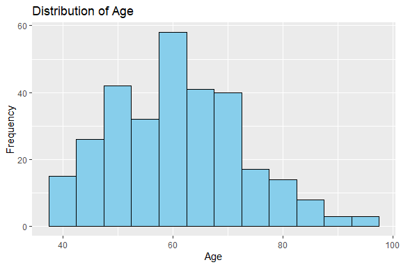
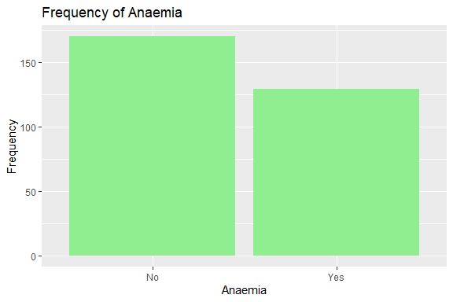
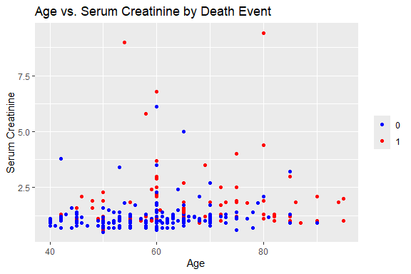
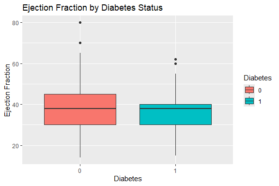
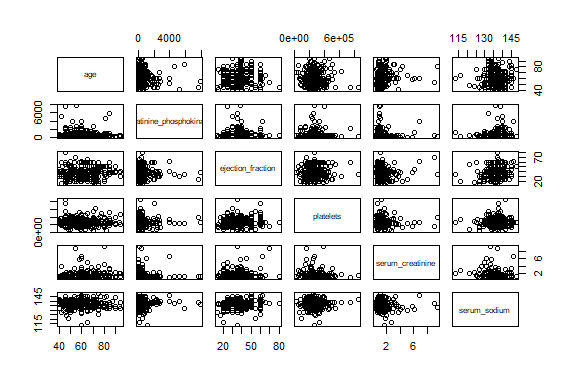

Heart Failure Prediction
================
Trevor Okinda
2024

- [Student Details](#student-details)
- [Setup Chunk](#setup-chunk)
  - [Source:](#source)
  - [Reference:](#reference)
- [Exploratory Data Analysis](#exploratory-data-analysis)
  - [Load dataset](#load-dataset)
  - [Measures of Frequency](#measures-of-frequency)
  - [Measures of Central Tendency](#measures-of-central-tendency)
  - [Measures of Distribution](#measures-of-distribution)
  - [Measures of Relationship](#measures-of-relationship)
  - [ANOVA](#anova)
  - [Plots](#plots)
- [Preprocessing and Data
  Transformation](#preprocessing-and-data-transformation)
  - [Missing Values](#missing-values)
- [Training Model](#training-model)
  - [Data Splitting](#data-splitting)
  - [Bootstrapping](#bootstrapping)
  - [Cross-validation](#cross-validation)
  - [Training Different Models](#training-different-models)
  - [Compare performance](#compare-performance)
  - [Saving Model](#saving-model)

# Student Details

|                       |                          |
|-----------------------|--------------------------|
| **Student ID Number** | 134780                   |
| **Student Name**      | Trevor Okinda            |
| **BBIT 4.2 Group**    | C                        |
| **Project Name**      | Heart Failure Prediction |

# Setup Chunk

**Note:** the following KnitR options have been set as the global
defaults: <BR>
`knitr::opts_chunk$set(echo = TRUE, warning = FALSE, eval = TRUE, collapse = FALSE, tidy = TRUE)`.

More KnitR options are documented here
<https://bookdown.org/yihui/rmarkdown-cookbook/chunk-options.html> and
here <https://yihui.org/knitr/options/>.

### Source:

The dataset that was used can be downloaded here: *\<<a
href="https://www.kaggle.com/datasets/andrewmvd/heart-failure-clinical-data\"
class="uri">https://www.kaggle.com/datasets/andrewmvd/heart-failure-clinical-data\</a>\>*

### Reference:

*\<Larxel. (2019). Heart Failure Prediction Dataset. Retrieved from
Kaggle <a
href="https://www.kaggle.com/datasets/andrewmvd/heart-failure-clinical-data\"
class="uri">https://www.kaggle.com/datasets/andrewmvd/heart-failure-clinical-data\</a>\>  
Refer to the APA 7th edition manual for rules on how to cite datasets:
<https://apastyle.apa.org/style-grammar-guidelines/references/examples/data-set-references>*

# Exploratory Data Analysis

## Load dataset

``` r
# Load dataset
heart_failure_data <- read.csv("heart_failure.csv", colClasses = c(
  age = "numeric",
  anaemia = "factor",
  creatinine_phosphokinase = "numeric",
  diabetes = "factor",
  ejection_fraction = "numeric",
  high_blood_pressure = "factor",
  platelets = "numeric",
  serum_creatinine = "numeric",
  serum_sodium = "numeric",
  sex = "factor",
  smoking = "factor",
  time = "numeric",
  DEATH_EVENT = "factor"
))

# Display the structure of the dataset
str(heart_failure_data)
```

    ## 'data.frame':    299 obs. of  13 variables:
    ##  $ age                     : num  75 55 65 50 65 90 75 60 65 80 ...
    ##  $ anaemia                 : Factor w/ 2 levels "0","1": 1 1 1 2 2 2 2 2 1 2 ...
    ##  $ creatinine_phosphokinase: num  582 7861 146 111 160 ...
    ##  $ diabetes                : Factor w/ 2 levels "0","1": 1 1 1 1 2 1 1 2 1 1 ...
    ##  $ ejection_fraction       : num  20 38 20 20 20 40 15 60 65 35 ...
    ##  $ high_blood_pressure     : Factor w/ 2 levels "0","1": 2 1 1 1 1 2 1 1 1 2 ...
    ##  $ platelets               : num  265000 263358 162000 210000 327000 ...
    ##  $ serum_creatinine        : num  1.9 1.1 1.3 1.9 2.7 2.1 1.2 1.1 1.5 9.4 ...
    ##  $ serum_sodium            : num  130 136 129 137 116 132 137 131 138 133 ...
    ##  $ sex                     : Factor w/ 2 levels "0","1": 2 2 2 2 1 2 2 2 1 2 ...
    ##  $ smoking                 : Factor w/ 2 levels "0","1": 1 1 2 1 1 2 1 2 1 2 ...
    ##  $ time                    : num  4 6 7 7 8 8 10 10 10 10 ...
    ##  $ DEATH_EVENT             : Factor w/ 2 levels "0","1": 2 2 2 2 2 2 2 2 2 2 ...

``` r
# View the first few rows of the dataset
head(heart_failure_data)
```

    ##   age anaemia creatinine_phosphokinase diabetes ejection_fraction
    ## 1  75       0                      582        0                20
    ## 2  55       0                     7861        0                38
    ## 3  65       0                      146        0                20
    ## 4  50       1                      111        0                20
    ## 5  65       1                      160        1                20
    ## 6  90       1                       47        0                40
    ##   high_blood_pressure platelets serum_creatinine serum_sodium sex smoking time
    ## 1                   1    265000              1.9          130   1       0    4
    ## 2                   0    263358              1.1          136   1       0    6
    ## 3                   0    162000              1.3          129   1       1    7
    ## 4                   0    210000              1.9          137   1       0    7
    ## 5                   0    327000              2.7          116   0       0    8
    ## 6                   1    204000              2.1          132   1       1    8
    ##   DEATH_EVENT
    ## 1           1
    ## 2           1
    ## 3           1
    ## 4           1
    ## 5           1
    ## 6           1

``` r
# View the dataset in a separate viewer window
View(heart_failure_data)
```

## Measures of Frequency

``` r
# Measures of Frequency
# Count of unique values in each factor variable
frequency <- sapply(heart_failure_data[, sapply(heart_failure_data, is.factor)], table)
print("Measures of Frequency:")
```

    ## [1] "Measures of Frequency:"

``` r
print(frequency)
```

    ##   anaemia diabetes high_blood_pressure sex smoking DEATH_EVENT
    ## 0     170      174                 194 105     203         203
    ## 1     129      125                 105 194      96          96

## Measures of Central Tendency

``` r
# Measures of Central Tendency
print("\nMeasures of Central Tendency:")
```

    ## [1] "\nMeasures of Central Tendency:"

``` r
# Mean
means <- colMeans(heart_failure_data[, sapply(heart_failure_data, is.numeric)], na.rm = TRUE)
print("Mean:")
```

    ## [1] "Mean:"

``` r
print(means)
```

    ##                      age creatinine_phosphokinase        ejection_fraction 
    ##                 60.83389                581.83946                 38.08361 
    ##                platelets         serum_creatinine             serum_sodium 
    ##             263358.02926                  1.39388                136.62542 
    ##                     time 
    ##                130.26087

``` r
# Median
medians <- apply(heart_failure_data[, sapply(heart_failure_data, is.numeric)], 2, median, na.rm = TRUE)
print("Median:")
```

    ## [1] "Median:"

``` r
print(medians)
```

    ##                      age creatinine_phosphokinase        ejection_fraction 
    ##                     60.0                    250.0                     38.0 
    ##                platelets         serum_creatinine             serum_sodium 
    ##                 262000.0                      1.1                    137.0 
    ##                     time 
    ##                    115.0

``` r
# Mode (for factor variables)
modes <- sapply(heart_failure_data[, sapply(heart_failure_data, is.factor)], function(x) names(which.max(table(x))))
print("Mode:")
```

    ## [1] "Mode:"

``` r
print(modes)
```

    ##             anaemia            diabetes high_blood_pressure                 sex 
    ##                 "0"                 "0"                 "0"                 "1" 
    ##             smoking         DEATH_EVENT 
    ##                 "0"                 "0"

## Measures of Distribution

``` r
# Measures of Distribution
print("\nMeasures of Distribution:")
```

    ## [1] "\nMeasures of Distribution:"

``` r
# Standard Deviation
sds <- apply(heart_failure_data[, sapply(heart_failure_data, is.numeric)], 2, sd, na.rm = TRUE)
print("Standard Deviation:")
```

    ## [1] "Standard Deviation:"

``` r
print(sds)
```

    ##                      age creatinine_phosphokinase        ejection_fraction 
    ##                11.894809               970.287881                11.834841 
    ##                platelets         serum_creatinine             serum_sodium 
    ##             97804.236869                 1.034510                 4.412477 
    ##                     time 
    ##                77.614208

``` r
# Range
ranges <- apply(heart_failure_data[, sapply(heart_failure_data, is.numeric)], 2, function(x) diff(range(x, na.rm = TRUE)))
print("Range:")
```

    ## [1] "Range:"

``` r
print(ranges)
```

    ##                      age creatinine_phosphokinase        ejection_fraction 
    ##                     55.0                   7838.0                     66.0 
    ##                platelets         serum_creatinine             serum_sodium 
    ##                 824900.0                      8.9                     35.0 
    ##                     time 
    ##                    281.0

``` r
# Interquartile Range (IQR)
iqrs <- apply(heart_failure_data[, sapply(heart_failure_data, is.numeric)], 2, IQR, na.rm = TRUE)
print("Interquartile Range (IQR):")
```

    ## [1] "Interquartile Range (IQR):"

``` r
print(iqrs)
```

    ##                      age creatinine_phosphokinase        ejection_fraction 
    ##                     19.0                    465.5                     15.0 
    ##                platelets         serum_creatinine             serum_sodium 
    ##                  91000.0                      0.5                      6.0 
    ##                     time 
    ##                    130.0

## Measures of Relationship

``` r
# Measures of Relationship
print("\nMeasures of Relationship:")
```

    ## [1] "\nMeasures of Relationship:"

``` r
# Correlation Matrix for numeric variables
correlation_matrix <- cor(heart_failure_data[, sapply(heart_failure_data, is.numeric)], use = "complete.obs")
print("Correlation Matrix:")
```

    ## [1] "Correlation Matrix:"

``` r
print(correlation_matrix)
```

    ##                                  age creatinine_phosphokinase ejection_fraction
    ## age                       1.00000000             -0.081583900        0.06009836
    ## creatinine_phosphokinase -0.08158390              1.000000000       -0.04407955
    ## ejection_fraction         0.06009836             -0.044079554        1.00000000
    ## platelets                -0.05235437              0.024463389        0.07217747
    ## serum_creatinine          0.15918713             -0.016408480       -0.01130247
    ## serum_sodium             -0.04596584              0.059550156        0.17590228
    ## time                     -0.22406842             -0.009345653        0.04172924
    ##                            platelets serum_creatinine serum_sodium         time
    ## age                      -0.05235437       0.15918713  -0.04596584 -0.224068420
    ## creatinine_phosphokinase  0.02446339      -0.01640848   0.05955016 -0.009345653
    ## ejection_fraction         0.07217747      -0.01130247   0.17590228  0.041729235
    ## platelets                 1.00000000      -0.04119808   0.06212462  0.010513909
    ## serum_creatinine         -0.04119808       1.00000000  -0.18909521 -0.149315418
    ## serum_sodium              0.06212462      -0.18909521   1.00000000  0.087640000
    ## time                      0.01051391      -0.14931542   0.08764000  1.000000000

## ANOVA

``` r
# Perform ANOVA for numeric variables across different factors
anova_results <- lapply(heart_failure_data[, sapply(heart_failure_data, is.numeric)], function(var) {
  anova_result <- lapply(heart_failure_data[, sapply(heart_failure_data, is.factor)], function(factor_var) {
    anova_result <- anova(lm(var ~ factor_var, data = heart_failure_data))
    return(anova_result)
  })
  return(anova_result)
})

# Print ANOVA results
print("ANOVA Results:")
```

    ## [1] "ANOVA Results:"

``` r
print(anova_results)
```

    ## $age
    ## $age$anaemia
    ## Analysis of Variance Table
    ## 
    ## Response: var
    ##             Df Sum Sq Mean Sq F value Pr(>F)
    ## factor_var   1    327  326.56  2.3183 0.1289
    ## Residuals  297  41836  140.86               
    ## 
    ## $age$diabetes
    ## Analysis of Variance Table
    ## 
    ## Response: var
    ##             Df Sum Sq Mean Sq F value  Pr(>F)  
    ## factor_var   1    430  430.21  3.0617 0.08119 .
    ## Residuals  297  41733  140.51                  
    ## ---
    ## Signif. codes:  0 '***' 0.001 '**' 0.01 '*' 0.05 '.' 0.1 ' ' 1
    ## 
    ## $age$high_blood_pressure
    ## Analysis of Variance Table
    ## 
    ## Response: var
    ##             Df Sum Sq Mean Sq F value Pr(>F)
    ## factor_var   1    367  366.94  2.6074 0.1074
    ## Residuals  297  41796  140.73               
    ## 
    ## $age$sex
    ## Analysis of Variance Table
    ## 
    ## Response: var
    ##             Df Sum Sq Mean Sq F value Pr(>F)
    ## factor_var   1    181  180.50  1.2769 0.2594
    ## Residuals  297  41982  141.35               
    ## 
    ## $age$smoking
    ## Analysis of Variance Table
    ## 
    ## Response: var
    ##             Df Sum Sq Mean Sq F value Pr(>F)
    ## factor_var   1     15  14.693  0.1035 0.7479
    ## Residuals  297  42148 141.913               
    ## 
    ## $age$DEATH_EVENT
    ## Analysis of Variance Table
    ## 
    ## Response: var
    ##             Df Sum Sq Mean Sq F value    Pr(>F)    
    ## factor_var   1   2714 2714.38  20.436 8.917e-06 ***
    ## Residuals  297  39449  132.82                      
    ## ---
    ## Signif. codes:  0 '***' 0.001 '**' 0.01 '*' 0.05 '.' 0.1 ' ' 1
    ## 
    ## 
    ## $creatinine_phosphokinase
    ## $creatinine_phosphokinase$anaemia
    ## Analysis of Variance Table
    ## 
    ## Response: var
    ##             Df    Sum Sq  Mean Sq F value    Pr(>F)    
    ## factor_var   1  10207179 10207179  11.213 0.0009168 ***
    ## Residuals  297 270347475   910261                      
    ## ---
    ## Signif. codes:  0 '***' 0.001 '**' 0.01 '*' 0.05 '.' 0.1 ' ' 1
    ## 
    ## $creatinine_phosphokinase$diabetes
    ## Analysis of Variance Table
    ## 
    ## Response: var
    ##             Df    Sum Sq Mean Sq F value Pr(>F)
    ## factor_var   1     26064   26064  0.0276 0.8682
    ## Residuals  297 280528591  944541               
    ## 
    ## $creatinine_phosphokinase$high_blood_pressure
    ## Analysis of Variance Table
    ## 
    ## Response: var
    ##             Df    Sum Sq Mean Sq F value Pr(>F)
    ## factor_var   1   1397988 1397988  1.4873 0.2236
    ## Residuals  297 279156666  939921               
    ## 
    ## $creatinine_phosphokinase$sex
    ## Analysis of Variance Table
    ## 
    ## Response: var
    ##             Df    Sum Sq Mean Sq F value Pr(>F)
    ## factor_var   1   1786164 1786164   1.903 0.1688
    ## Residuals  297 278768491  938614               
    ## 
    ## $creatinine_phosphokinase$smoking
    ## Analysis of Variance Table
    ## 
    ## Response: var
    ##             Df    Sum Sq Mean Sq F value Pr(>F)
    ## factor_var   1      1645    1645  0.0017 0.9667
    ## Residuals  297 280553010  944623               
    ## 
    ## $creatinine_phosphokinase$DEATH_EVENT
    ## Analysis of Variance Table
    ## 
    ## Response: var
    ##             Df    Sum Sq Mean Sq F value Pr(>F)
    ## factor_var   1   1103933 1103933  1.1733 0.2796
    ## Residuals  297 279450722  940912               
    ## 
    ## 
    ## $ejection_fraction
    ## $ejection_fraction$anaemia
    ## Analysis of Variance Table
    ## 
    ## Response: var
    ##             Df Sum Sq Mean Sq F value Pr(>F)
    ## factor_var   1     42  41.565  0.2961 0.5868
    ## Residuals  297  41697 140.395               
    ## 
    ## $ejection_fraction$diabetes
    ## Analysis of Variance Table
    ## 
    ## Response: var
    ##             Df Sum Sq Mean Sq F value Pr(>F)
    ## factor_var   1      1   0.982   0.007 0.9334
    ## Residuals  297  41738 140.532               
    ## 
    ## $ejection_fraction$high_blood_pressure
    ## Analysis of Variance Table
    ## 
    ## Response: var
    ##             Df Sum Sq Mean Sq F value Pr(>F)
    ## factor_var   1     25  24.941  0.1776 0.6738
    ## Residuals  297  41714 140.451               
    ## 
    ## $ejection_fraction$sex
    ## Analysis of Variance Table
    ## 
    ## Response: var
    ##             Df Sum Sq Mean Sq F value  Pr(>F)  
    ## factor_var   1    919  919.02  6.6867 0.01019 *
    ## Residuals  297  40820  137.44                  
    ## ---
    ## Signif. codes:  0 '***' 0.001 '**' 0.01 '*' 0.05 '.' 0.1 ' ' 1
    ## 
    ## $ejection_fraction$smoking
    ## Analysis of Variance Table
    ## 
    ## Response: var
    ##             Df Sum Sq Mean Sq F value Pr(>F)
    ## factor_var   1    189  189.13  1.3519 0.2459
    ## Residuals  297  41550  139.90               
    ## 
    ## $ejection_fraction$DEATH_EVENT
    ## Analysis of Variance Table
    ## 
    ## Response: var
    ##             Df Sum Sq Mean Sq F value    Pr(>F)    
    ## factor_var   1   3011  3011.4  23.094 2.453e-06 ***
    ## Residuals  297  38728   130.4                      
    ## ---
    ## Signif. codes:  0 '***' 0.001 '**' 0.01 '*' 0.05 '.' 0.1 ' ' 1
    ## 
    ## 
    ## $platelets
    ## $platelets$anaemia
    ## Analysis of Variance Table
    ## 
    ## Response: var
    ##             Df     Sum Sq    Mean Sq F value Pr(>F)
    ## factor_var   1 5.4650e+09 5465038364  0.5705 0.4507
    ## Residuals  297 2.8451e+12 9579475586               
    ## 
    ## $platelets$diabetes
    ## Analysis of Variance Table
    ## 
    ## Response: var
    ##             Df     Sum Sq    Mean Sq F value Pr(>F)
    ## factor_var   1 2.4228e+10 2.4228e+10   2.546 0.1116
    ## Residuals  297 2.8263e+12 9.5163e+09               
    ## 
    ## $platelets$high_blood_pressure
    ## Analysis of Variance Table
    ## 
    ## Response: var
    ##             Df     Sum Sq    Mean Sq F value Pr(>F)
    ## factor_var   1 7.1160e+09 7116017082  0.7433 0.3893
    ## Residuals  297 2.8435e+12 9573916735               
    ## 
    ## $platelets$sex
    ## Analysis of Variance Table
    ## 
    ## Response: var
    ##             Df     Sum Sq    Mean Sq F value  Pr(>F)  
    ## factor_var   1 4.4626e+10 4.4626e+10  4.7235 0.03054 *
    ## Residuals  297 2.8059e+12 9.4476e+09                  
    ## ---
    ## Signif. codes:  0 '***' 0.001 '**' 0.01 '*' 0.05 '.' 0.1 ' ' 1
    ## 
    ## $platelets$smoking
    ## Analysis of Variance Table
    ## 
    ## Response: var
    ##             Df     Sum Sq    Mean Sq F value Pr(>F)
    ## factor_var   1 2.2724e+09 2272428334   0.237 0.6268
    ## Residuals  297 2.8483e+12 9590225114               
    ## 
    ## $platelets$DEATH_EVENT
    ## Analysis of Variance Table
    ## 
    ## Response: var
    ##             Df     Sum Sq    Mean Sq F value Pr(>F)
    ## factor_var   1 6.8831e+09 6883065405  0.7189 0.3972
    ## Residuals  297 2.8437e+12 9574701084               
    ## 
    ## 
    ## $serum_creatinine
    ## $serum_creatinine$anaemia
    ## Analysis of Variance Table
    ## 
    ## Response: var
    ##             Df Sum Sq Mean Sq F value Pr(>F)
    ## factor_var   1   0.87 0.86814  0.8107 0.3687
    ## Residuals  297 318.05 1.07089               
    ## 
    ## $serum_creatinine$diabetes
    ## Analysis of Variance Table
    ## 
    ## Response: var
    ##             Df Sum Sq Mean Sq F value Pr(>F)
    ## factor_var   1   0.70 0.70376  0.6568 0.4183
    ## Residuals  297 318.22 1.07144               
    ## 
    ## $serum_creatinine$high_blood_pressure
    ## Analysis of Variance Table
    ## 
    ## Response: var
    ##             Df Sum Sq Mean Sq F value Pr(>F)
    ## factor_var   1   0.01 0.00777  0.0072 0.9323
    ## Residuals  297 318.92 1.07379               
    ## 
    ## $serum_creatinine$sex
    ## Analysis of Variance Table
    ## 
    ## Response: var
    ##             Df Sum Sq Mean Sq F value Pr(>F)
    ## factor_var   1   0.02 0.01549  0.0144 0.9045
    ## Residuals  297 318.91 1.07376               
    ## 
    ## $serum_creatinine$smoking
    ## Analysis of Variance Table
    ## 
    ## Response: var
    ##             Df Sum Sq Mean Sq F value Pr(>F)
    ## factor_var   1   0.24 0.23968  0.2234 0.6368
    ## Residuals  297 318.68 1.07301               
    ## 
    ## $serum_creatinine$DEATH_EVENT
    ## Analysis of Variance Table
    ## 
    ## Response: var
    ##             Df  Sum Sq Mean Sq F value   Pr(>F)    
    ## factor_var   1  27.618 27.6185  28.159 2.19e-07 ***
    ## Residuals  297 291.304  0.9808                     
    ## ---
    ## Signif. codes:  0 '***' 0.001 '**' 0.01 '*' 0.05 '.' 0.1 ' ' 1
    ## 
    ## 
    ## $serum_sodium
    ## $serum_sodium$anaemia
    ## Analysis of Variance Table
    ## 
    ## Response: var
    ##             Df Sum Sq Mean Sq F value Pr(>F)
    ## factor_var   1   10.2  10.177  0.5219 0.4706
    ## Residuals  297 5791.9  19.501               
    ## 
    ## $serum_sodium$diabetes
    ## Analysis of Variance Table
    ## 
    ## Response: var
    ##             Df Sum Sq Mean Sq F value Pr(>F)
    ## factor_var   1   46.5  46.528   2.401 0.1223
    ## Residuals  297 5755.5  19.379               
    ## 
    ## $serum_sodium$high_blood_pressure
    ## Analysis of Variance Table
    ## 
    ## Response: var
    ##             Df Sum Sq Mean Sq F value Pr(>F)
    ## factor_var   1    8.0  7.9901  0.4096 0.5227
    ## Residuals  297 5794.1 19.5086               
    ## 
    ## $serum_sodium$sex
    ## Analysis of Variance Table
    ## 
    ## Response: var
    ##             Df Sum Sq Mean Sq F value Pr(>F)
    ## factor_var   1    4.4  4.4089  0.2259  0.635
    ## Residuals  297 5797.6 19.5207               
    ## 
    ## $serum_sodium$smoking
    ## Analysis of Variance Table
    ## 
    ## Response: var
    ##             Df Sum Sq Mean Sq F value Pr(>F)
    ## factor_var   1    0.1  0.1344  0.0069 0.9339
    ## Residuals  297 5801.9 19.5351               
    ## 
    ## $serum_sodium$DEATH_EVENT
    ## Analysis of Variance Table
    ## 
    ## Response: var
    ##             Df Sum Sq Mean Sq F value    Pr(>F)    
    ## factor_var   1  221.1 221.084  11.765 0.0006889 ***
    ## Residuals  297 5581.0  18.791                      
    ## ---
    ## Signif. codes:  0 '***' 0.001 '**' 0.01 '*' 0.05 '.' 0.1 ' ' 1
    ## 
    ## 
    ## $time
    ## $time$anaemia
    ## Analysis of Variance Table
    ## 
    ## Response: var
    ##             Df  Sum Sq Mean Sq F value  Pr(>F)  
    ## factor_var   1   35899   35899  6.0606 0.01439 *
    ## Residuals  297 1759243    5923                  
    ## ---
    ## Signif. codes:  0 '***' 0.001 '**' 0.01 '*' 0.05 '.' 0.1 ' ' 1
    ## 
    ## $time$diabetes
    ## Analysis of Variance Table
    ## 
    ## Response: var
    ##             Df  Sum Sq Mean Sq F value Pr(>F)
    ## factor_var   1    2042  2041.8  0.3382 0.5613
    ## Residuals  297 1793100  6037.4               
    ## 
    ## $time$high_blood_pressure
    ## Analysis of Variance Table
    ## 
    ## Response: var
    ##             Df  Sum Sq Mean Sq F value    Pr(>F)    
    ## factor_var   1   69272   69272  11.921 0.0006358 ***
    ## Residuals  297 1725870    5811                      
    ## ---
    ## Signif. codes:  0 '***' 0.001 '**' 0.01 '*' 0.05 '.' 0.1 ' ' 1
    ## 
    ## $time$sex
    ## Analysis of Variance Table
    ## 
    ## Response: var
    ##             Df  Sum Sq Mean Sq F value Pr(>F)
    ## factor_var   1     437   437.3  0.0724 0.7881
    ## Residuals  297 1794704  6042.8               
    ## 
    ## $time$smoking
    ## Analysis of Variance Table
    ## 
    ## Response: var
    ##             Df  Sum Sq Mean Sq F value Pr(>F)
    ## factor_var   1     936   936.4   0.155 0.6941
    ## Residuals  297 1794205  6041.1               
    ## 
    ## $time$DEATH_EVENT
    ## Analysis of Variance Table
    ## 
    ## Response: var
    ##             Df  Sum Sq Mean Sq F value    Pr(>F)    
    ## factor_var   1  498494  498494  114.18 < 2.2e-16 ***
    ## Residuals  297 1296647    4366                      
    ## ---
    ## Signif. codes:  0 '***' 0.001 '**' 0.01 '*' 0.05 '.' 0.1 ' ' 1

## Plots

``` r
# Load required libraries
library(ggplot2)

# Univariate Plots
# Histogram of age
ggplot(heart_failure_data, aes(x = age)) +
  geom_histogram(binwidth = 5, fill = "skyblue", color = "black") +
  labs(title = "Distribution of Age", x = "Age", y = "Frequency")
```

<!-- -->

``` r
# Bar plot of anaemia
ggplot(heart_failure_data, aes(x = anaemia)) +
  geom_bar(fill = "lightgreen") +
  labs(title = "Frequency of Anaemia", x = "Anaemia", y = "Frequency") +
  scale_x_discrete(labels = c("No", "Yes"))
```

<!-- -->

``` r
# Multivariate Plot
# Scatter plot of age vs. serum_creatinine colored by DEATH_EVENT
ggplot(heart_failure_data, aes(x = age, y = serum_creatinine, color = DEATH_EVENT)) +
  geom_point() +
  labs(title = "Age vs. Serum Creatinine by Death Event", x = "Age", y = "Serum Creatinine", color = "Death Event") +
  scale_color_manual(values = c("blue", "red")) +
  theme(legend.title = element_blank())
```

<!-- -->

``` r
# Box plot of ejection_fraction by diabetes
ggplot(heart_failure_data, aes(x = diabetes, y = ejection_fraction, fill = diabetes)) +
  geom_boxplot() +
  labs(title = "Ejection Fraction by Diabetes Status", x = "Diabetes", y = "Ejection Fraction", fill = "Diabetes")
```

<!-- -->

``` r
# Pairwise scatter plot of numeric variables
pairs(~ age + creatinine_phosphokinase + ejection_fraction + platelets + serum_creatinine + serum_sodium, data = heart_failure_data)
```

<!-- -->

# Preprocessing and Data Transformation

## Missing Values

``` r
# Check for missing values
missing_values <- colSums(is.na(heart_failure_data))
print("Presence of Missing Values:")
```

    ## [1] "Presence of Missing Values:"

``` r
print(missing_values)
```

    ##                      age                  anaemia creatinine_phosphokinase 
    ##                        0                        0                        0 
    ##                 diabetes        ejection_fraction      high_blood_pressure 
    ##                        0                        0                        0 
    ##                platelets         serum_creatinine             serum_sodium 
    ##                        0                        0                        0 
    ##                      sex                  smoking                     time 
    ##                        0                        0                        0 
    ##              DEATH_EVENT 
    ##                        0

# Training Model

## Data Splitting

``` r
## Load required package
library(caret)
```

    ## Loading required package: lattice

``` r
# Data Splitting
set.seed(123)  # For reproducibility
train_index <- createDataPartition(heart_failure_data$DEATH_EVENT, p = 0.7, list = FALSE)
train_data <- heart_failure_data[train_index, ]
test_data <- heart_failure_data[-train_index, ]

# Print the dimensions of the training and testing sets
cat("Training set dimensions:", dim(train_data), "\n")
```

    ## Training set dimensions: 211 13

``` r
cat("Testing set dimensions:", dim(test_data), "\n")
```

    ## Testing set dimensions: 88 13

## Bootstrapping

``` r
# Bootstrapping
boot_data <- createDataPartition(1:nrow(heart_failure_data), p = 0.8, list = FALSE)
bootstrapped_samples <- heart_failure_data[boot_data, ]
```

## Cross-validation

``` r
# Cross-validation
# Basic cross-validation
cv_model <- train(DEATH_EVENT ~ ., data = heart_failure_data, method = "glm", trControl = trainControl(method = "cv"))
print("Basic Cross-validation:")
```

    ## [1] "Basic Cross-validation:"

``` r
print(cv_model)
```

    ## Generalized Linear Model 
    ## 
    ## 299 samples
    ##  12 predictor
    ##   2 classes: '0', '1' 
    ## 
    ## No pre-processing
    ## Resampling: Cross-Validated (10 fold) 
    ## Summary of sample sizes: 269, 270, 269, 269, 268, 270, ... 
    ## Resampling results:
    ## 
    ##   Accuracy  Kappa    
    ##   0.825825  0.5879111

## Training Different Models

``` r
# Load required libraries
library(caret)
library(randomForest)
```

    ## randomForest 4.7-1.1

    ## Type rfNews() to see new features/changes/bug fixes.

    ## 
    ## Attaching package: 'randomForest'

    ## The following object is masked from 'package:ggplot2':
    ## 
    ##     margin

``` r
library(glmnet)
```

    ## Loading required package: Matrix

    ## Loaded glmnet 4.1-8

``` r
# Set seed for reproducibility
set.seed(123)

# Define training control
train_control <- trainControl(method = "cv", number = 5)

# Train Random Forest model
rf_model <- train(DEATH_EVENT ~ ., data = heart_failure_data, method = "rf", trControl = train_control)
print("Random Forest Model:")
```

    ## [1] "Random Forest Model:"

``` r
print(rf_model)
```

    ## Random Forest 
    ## 
    ## 299 samples
    ##  12 predictor
    ##   2 classes: '0', '1' 
    ## 
    ## No pre-processing
    ## Resampling: Cross-Validated (5 fold) 
    ## Summary of sample sizes: 239, 239, 239, 240, 239 
    ## Resampling results across tuning parameters:
    ## 
    ##   mtry  Accuracy   Kappa    
    ##    2    0.8461017  0.6338963
    ##    7    0.8259887  0.5911675
    ##   12    0.8158192  0.5734135
    ## 
    ## Accuracy was used to select the optimal model using the largest value.
    ## The final value used for the model was mtry = 2.

``` r
# Train glmnet model
glmnet_model <- train(DEATH_EVENT ~ ., data = heart_failure_data, method = "glmnet", trControl = train_control)
print("GLMNET Model:")
```

    ## [1] "GLMNET Model:"

``` r
print(glmnet_model)
```

    ## glmnet 
    ## 
    ## 299 samples
    ##  12 predictor
    ##   2 classes: '0', '1' 
    ## 
    ## No pre-processing
    ## Resampling: Cross-Validated (5 fold) 
    ## Summary of sample sizes: 239, 239, 239, 239, 240 
    ## Resampling results across tuning parameters:
    ## 
    ##   alpha  lambda        Accuracy   Kappa    
    ##   0.10   0.0004920658  0.8294915  0.5976864
    ##   0.10   0.0049206583  0.8294915  0.5976864
    ##   0.10   0.0492065830  0.8328249  0.5939955
    ##   0.55   0.0004920658  0.8294915  0.5976864
    ##   0.55   0.0049206583  0.8261017  0.5907383
    ##   0.55   0.0492065830  0.8461582  0.6234854
    ##   1.00   0.0004920658  0.8294915  0.5976864
    ##   1.00   0.0049206583  0.8327119  0.6056841
    ##   1.00   0.0492065830  0.8293785  0.5738137
    ## 
    ## Accuracy was used to select the optimal model using the largest value.
    ## The final values used for the model were alpha = 0.55 and lambda = 0.04920658.

``` r
# Train Generalized Linear Model (GLM)
glm_model <- train(DEATH_EVENT ~ ., data = heart_failure_data, method = "glm", trControl = train_control)
print("GLM Model:")
```

    ## [1] "GLM Model:"

``` r
print(glm_model)
```

    ## Generalized Linear Model 
    ## 
    ## 299 samples
    ##  12 predictor
    ##   2 classes: '0', '1' 
    ## 
    ## No pre-processing
    ## Resampling: Cross-Validated (5 fold) 
    ## Summary of sample sizes: 240, 240, 239, 238, 239 
    ## Resampling results:
    ## 
    ##   Accuracy   Kappa    
    ##   0.8121867  0.5538917

## Compare performance

``` r
# Compare model performance using resamples
resamps <- resamples(list(Random_Forest = rf_model, GLMNET = glmnet_model, GLM = glm_model))
summary(resamps)
```

    ## 
    ## Call:
    ## summary.resamples(object = resamps)
    ## 
    ## Models: Random_Forest, GLMNET, GLM 
    ## Number of resamples: 5 
    ## 
    ## Accuracy 
    ##                    Min.   1st Qu.    Median      Mean   3rd Qu.      Max. NA's
    ## Random_Forest 0.8305085 0.8333333 0.8333333 0.8461017 0.8666667 0.8666667    0
    ## GLMNET        0.7833333 0.8474576 0.8500000 0.8461582 0.8666667 0.8833333    0
    ## GLM           0.7118644 0.7966102 0.8333333 0.8121867 0.8524590 0.8666667    0
    ## 
    ## Kappa 
    ##                    Min.   1st Qu.    Median      Mean   3rd Qu.      Max. NA's
    ## Random_Forest 0.5792426 0.5918367 0.6222791 0.6338963 0.6842105 0.6919127    0
    ## GLMNET        0.4613260 0.6247350 0.6301370 0.6234854 0.7003745 0.7008547    0
    ## GLM           0.2911661 0.5342105 0.5918367 0.5538917 0.6518706 0.7003745    0

## Saving Model

``` r
# Load the saved Random Forest model
loaded_heart_failure_rf_model <- readRDS("./models/heart_failure_rf_model.rds")

# Sample new data 
new_heart_failure_data <- data.frame(
  age = c(55, 65, 75),  
  anaemia = factor(c(0, 1, 0)),  
  creatinine_phosphokinase = c(7861, 146, 582),  
  diabetes = factor(c(0, 0, 0)),  
  ejection_fraction = c(38, 20, 20),  
  high_blood_pressure = factor(c(0, 0, 1)),  
  platelets = c(263358.03, 162000, 265000),  
  serum_creatinine = c(1.1, 1.3, 1.9),  
  serum_sodium = c(136, 129, 130),  
  sex = factor(c(1, 1, 1)),  
  smoking = factor(c(0, 1, 0)),  
  time = c(6, 7, 4),  
  DEATH_EVENT = factor(c(1, 1, 1))
)

# Use the loaded model to make predictions for new data
predictions <- predict(loaded_heart_failure_rf_model, new_heart_failure_data)

# Print predictions
print(predictions)
```

    ## [1] 1 1 1
    ## Levels: 0 1
